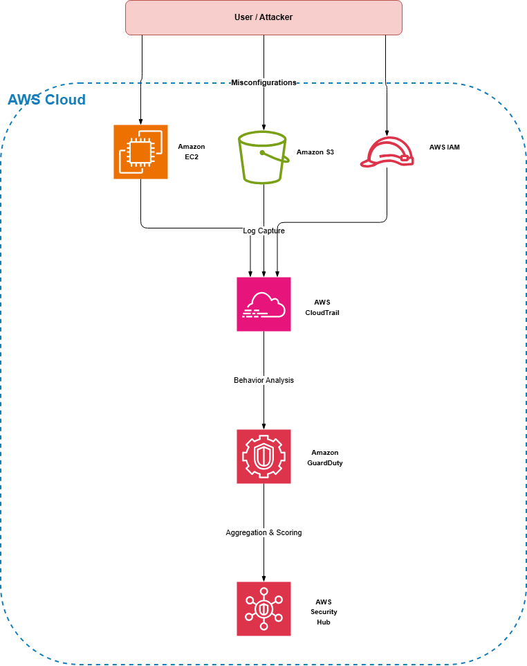

---
title : "Architecture"
date : 2026-06-26 
weight : 3
chapter : false
pre : " <b> 5.3. </b> "
---

#### Architecture Diagram

The data flow and security detection pipeline for this workshop is as follows:

  
   
  <em>
    <a href="architecture.drawio" target="_blank">Open in draw.io editor</a>
    &nbsp;|&nbsp;
    <a href="https://viewer.diagrams.net/?tags=%7B%7D&lightbox=1&highlight=0000ff&edit=_blank&layers=1&nav=1&title=architecture.drawio&dark=auto#R%3Cmxfile%3E%3Cdiagram%20name%3D%22AWS%20Security%20Architecture%22%20id%3D%220%22%3E7V1dc9o8Fv41mUkvYPxtuCSEtJm33c2Ubvt2bzLCFkaNsXhlkUAv9revZMvYlsxHjCHQENpgHUu2fHSeR0dHknNl9qeLjwTMJl%2BwD8MrQ%2FMXV%2BbtlWGYbtdhX1yyTCV6J5MEBPmpTMsFQ%2FQbioyZdI58GAtZKqIYhxTNykIPRxH0aEkGCMEv5WxjHPolwQwEsFQNLhh6IIRKth%2FIp5NU2rELuT9BFEyyO%2BuaODMFWWYhiCfAxy8FkTm4MvsEY5oeTRd9GHLtlfVyt%2BbsqmIERnSXAlCUgH4gP1t%2BCSGK8Zx4IpcpRHSZ6YRfYSiSmNAJDnAEwkEuvSF4HvmQ31hjqTzPZ4xnTKgz4S9I6VK0N5hTzEQTOg3F2ZgS%2FLTSONPVDVwg%2Bje%2FYNsUqZ8iLz%2B%2BXYh7JYlllogoWaaF7Cz5s3guL5ak8nJ%2Bj9sOS45C7D19m6AoFd%2BhMKtiYl3iAXh6jCOaJXmFQzCC4Q3wnoJEG30cYpLoz7yz%2BSe76wMkaAopJOLmU%2FwMRmF2VQJj9LuYxhTQQpoBDhbT0EfFJK%2F9qh0ERgqnBaAACaAwAIHOZxDORWsPh5%2BYYLCYhRjRld0yxEPMqk2W7CSBIaDouWxWQCAvWOXLjZMdCPustlVzvWXmZojnNEQR7K%2BQr4lWKKiafe7YgXkTEOAjmJ%2BLcARXdlYoME5%2B%2BIVYS1ddyAfxZKXRZ0goYmTxmbf1A44RRTjiVoMpxdNChl6IAn6Ccvu%2FASLlsQrxdi9a%2FssEUTicgQR%2BL4xVJdMys7RQBK8Go5YZP54uAk7DbfASW20vRInyJDAq7XtlOCHPFs9AVFKw88%2Bcc9PNaGXDLS9VSI%2B3eTC6NkxGOawxteLBh%2BQmWWF2FPDv%2F8TsQTlD3bHfPUrZNbkgvTWTpndP84oqMtXBRaHxVbubFJi3Iyz3JWdpt5OKxEVahmulgqwz0t39TRUafwitun8Mrb4tg3YVhH2E9N%2BjX5yj9mPPpCjTIFgWMswwimhcuPIDFxStXu%2B2LbNk%2BJbrtG237C1IxTqGvaUIO0jrksNk9VC7Icf8I5CjF3AjALEBOUd0LP4ugrBQu40IPTmH5GX6X%2Bfzz9%2F61wXT3ah781fr8bll6QrIeqN5DJnovvflTWCmZwObrHOxzba%2BEWK66Wgiy16FXMvYXMTWnE0FykBWi1sdrbL4Sjdpc4liUs%2F5Skqw61FC97QoIaeBS2e6H%2Fp1Y62%2Fyp%2Bl0l%2FlJ1px8pTcUdWt2SK5tlbtyIbch2z5gDxdb%2FBpk6PkvCOkq%2B8P1R5v7%2BGene6DMIwLfm5a69zPPTZPyf16x5SiBjL6tQxctQs4Wwro%2Bqb8%2B7sZ%2Bmv8jJNhEKMWhRgnySEn6FboaqDjC44Qxeko1QHTWUoaX%2BGU3QtQ2ARaFeM3HKPbLiPS7Opt0%2BharuWwrtvqZoDNLpr2e430trpVr7u1Tg0sbg2w6K91jffDiqWdQ3%2BbDa4KsPjOcDteHsj6nc6bWX%2FlwMJ4DSIu5t98V6GapFXhAZ60Lao%2Bl1YeQOmuaR5qBGXtYq6XyDm8aiByPoTenCDKjW8QBUyhPKJ9kNC14Wjl0LVpNzDLYu9iK5Ua4vidPT7PPENq73XG0elbd3d3lTQm2d0qZ7GpZDIxtxpICMdiUsNDUfA5SaUkJETfEt41RMdIAWs%2BIu7EBochmMVotDITn%2BDZt4yT9O2W8f2BDw2vvyNC54Cr%2FIGg58SH1PohnvsfatmJabmKoehOt1sylZZVJjFHZq06luKqlmIrllLWSRUaC2CVSGLc8aDnVVnOqGNb9pqJqxo61DVb0aGVTdFnaDPKfG03oMHOLhpkD0Kren0JXRWAU3hRRscU%2BX7iiGxjSWO7dWfhjFEWyCgQ4UfODGlgBUUxl8NWHBQCIKM8%2BsFoz9T5He6jEb9jWiydb75%2BYD4SD68YDCvamLA%2BwdC0dvJhV9HOqvFjfYQXB4XQOt5NOt%2FBWt4tdoXVfNoM6kxLU5nLlTTfMqS4dgOKNyoVr%2FZyx1R8Qyo1KlRqapJKHcnzXAXb9tFqFpTdrFIRiWTH9g37x4Op6X%2F7lkdOmYRHq1RhlcxVhbqajX3pVXeQhVUyVxXqajaeympdFlbJXFutsVxaryitS6Vt7j3v7LMP1N514Oq2e7PRaT%2B0cy53MTL7gHiWPtYYLXg9qj1zAtMx173H68OjI%2BmR7L8zF4sSgEKlL1s%2FAh04%2FFMFz8Rj%2B5ZcLu%2By%2BDMSELbS29QBcObir%2Ff6XaMMXsM2GgDvTmurLuA9GfC6vZ6uO%2B8GvLHZCGiHZgGsYw%2F8aoU4iA8EVFPyGRlStQaQ6lyQelZIvb01Lav%2FfpAqRn2Pk%2FmoGczmw8hP81ERvyjyUcThy1qcT8r174e1oNzRFShnoqzPtToHgHJs%2FbHjkNVOjVeNQ2yzAa3uNjdz4LCUjLgKrUrRkhs4xoSHAj8B4sOIGfaW8Ehi7drQ46WSEMn%2FLOsqix68srkcNQJiOOXG0ru21FjdJhprp0HjuUbACk2pDSmcxVua9AuI0sBwyme9OcWtbKUB7wTqNK1d0bQSDm1NadoGwlu7bdfYB4e%2BDTu%2BVYXDjjEyHacWDntjmuxJqA%2FDZLOXnUQrQRzDmmH9HSDp2geB5E6ThftDUszF1AZk5tgUmj392Q7UodnmkutkJQQ7eJiPQuRxxHkejOMPV4XFPgQQklxDS1uzeC4axWk0VEq7%2Fa1ZkiXJfMmudv0vzH7%2FQKHvMZPj98GsMsvjVGLQN9p6l9fiK2QNiPhuBB5r33L3Oh6BpdhzV9vSxThOAzwERcT4tcuZsnjmqSzoeN2Ogror%2Fd%2FF8mF1OdOQJs7XUbYxwk5NgzzrLS4Xg9xgkOpqph5ro%2BXvo5lkt6ZJntyazzrro0smeSIGeR6Lo%2B9WIZjjmGkWVXi1naqT6udnpye6NvM8LLWPp7MQgcg7GqU69Ux1487Gs7ZfsZn85JiWVfbEzNdQzLe0bez4%2B8N0O1tZuut%2BL4NvDO%2FmP51NxbftNbX18uYxtyM94IHX%2F1s7hZTjJ0i9iWjnywTcZQLubSbgkM8qwCfgQOQ%2FgiSg9TgFEQjgNF2%2FrpDLcd71kmzBb%2B7NLtvn3xltGGXa0KQNFrX69Zq745xT68FrvTDrspP0FPrwXW31slTkvHqqwa3LJ4%2FeS08FPXVStc4Kka39l9oZDfr5zB%2FJhM%2FzMIIkgfVRO6ryJi4ne2XMXqvEdprEu0D%2FZKD%2FzpzUYA6I78%2FpshEC%2BMivdsuvVlhL8Znl8Zk%2F4NVeOrEdubYpvTuwmSWeO23BvID3ZMD73nZS4GiMAgW5bzSu7Ke1UXrz7FkSx9rDxG%2F2zaI7jD8115HZoQGnvnshh7Mih8tOjTcihmSzh0QKs2SlV2s0Z8N5elw6cDtlNmjEz68OV1dsK9%2BRIhR6kKlBoYUyJShwk6GmwKwMeIUTZOJQ2KVMQAoHyEShsMlGiK95y8krXi9SBTf5zRJJS0AyeIZpg6R55LdNEL4PIkbP8CtMX2O4%2FlUlQbrdnlW%2F0vdOXtPBDh%2BTLZGPIMXi2j0CFWs4a7xlw9xEmSUCVANnP%2FgS22TDZS1s5lskS4ugsxDdaqO5WV5%2BaNfw5Vky%2F9sN6fRT%2FicwzMH%2FAQ%3D%3D%3C%2Fdiagram%3E%3C%2Fmxfile%3E" target="_blank">Open in diagrams.net editor</a>
  </em>

#### Architecture Flow Explanation

1. **Vulnerability Entry** - An attacker or user exploits misconfigurations on EC2, S3, or IAM (e.g., public S3 bucket, global SSH access, `*/*` IAM policy).
2. **Log Capture** - AWS CloudTrail records all API calls, including malicious or unauthorized actions.
3. **Threat Detection** - Amazon GuardDuty analyzes behavior and logs to detect threats and anomalies.
4. **Aggregation & Assessment** - AWS Security Hub aggregates findings from GuardDuty and automatically scores compliance against the CIS AWS Foundations Benchmark.

#### AWS Services Used

| Service | Role |
|---------|------|
| **AWS CloudTrail** | Centralized API logging and audit trail |
| **Amazon GuardDuty** | ML-powered threat detection |
| **AWS Security Hub** | Centralized security findings and compliance assessment |
| **Amazon S3** | Storage for CloudTrail logs and potentially vulnerable data |
| **Amazon EC2** | Compute instances (with intentional misconfigurations initially) |
| **AWS IAM** | Identity and access management (including over-privileged roles) |
