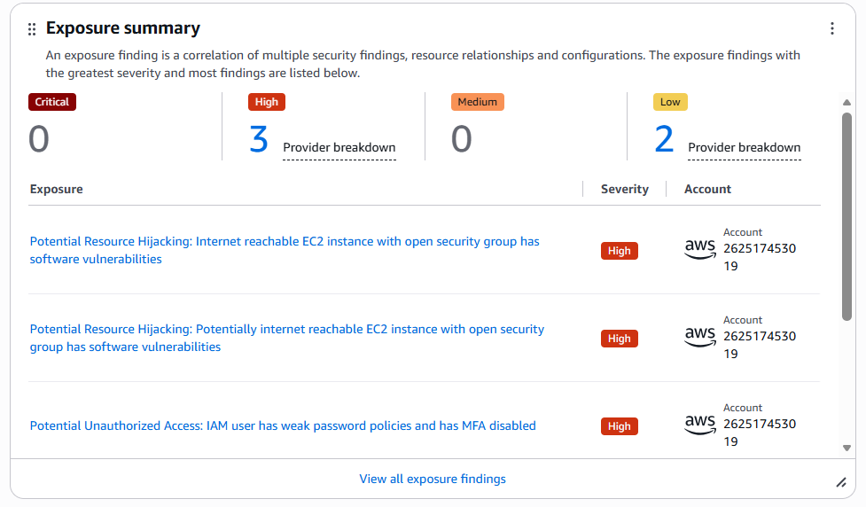
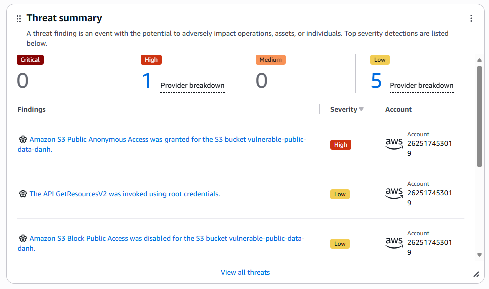
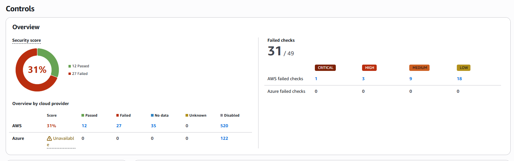
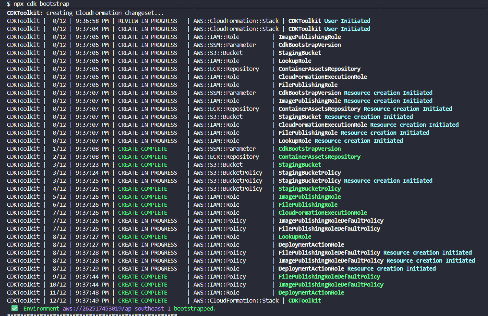
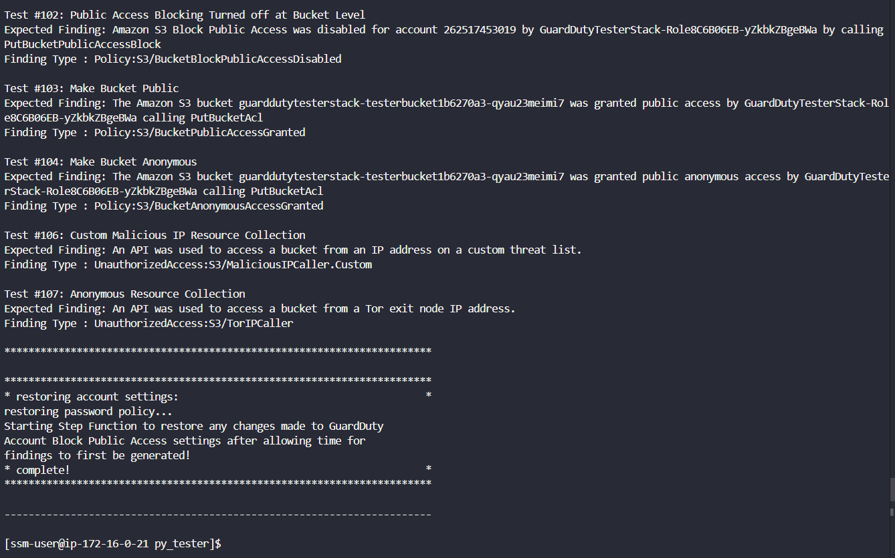
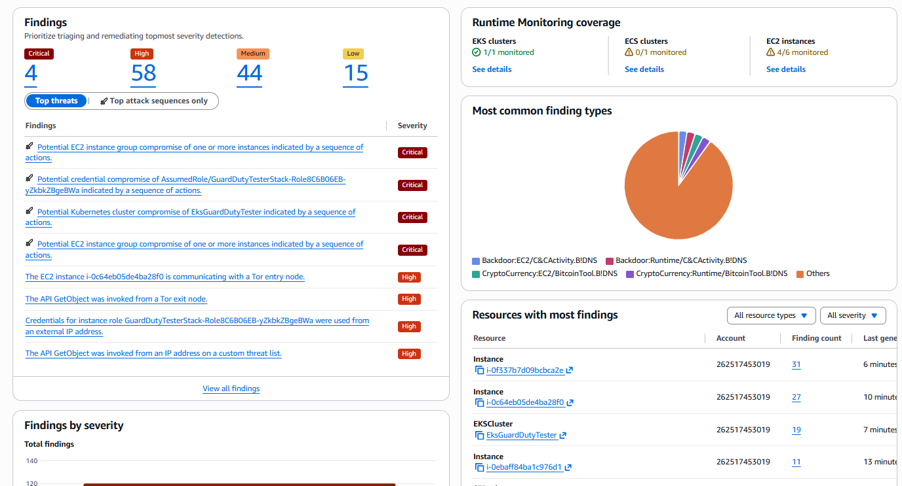
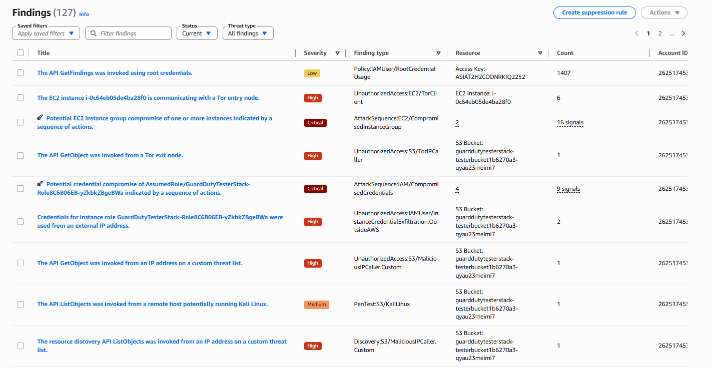
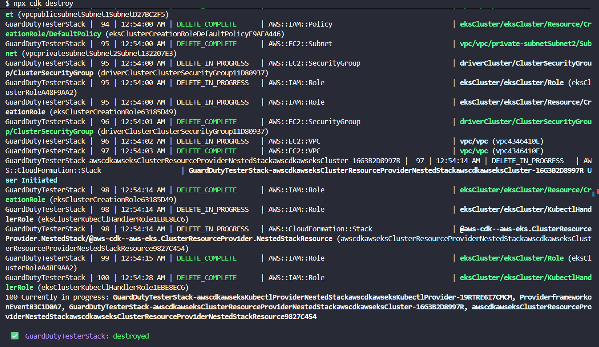

#### Bước 3: Kiểm thử và Đo lường

Sau khi triển khai hạ tầng lỗi cấu hình, chờ khoảng **30 - 60 phút** để Security Hub và GuardDuty hoàn tất chu kỳ quét ban đầu.

**1. Kiểm tra Security Hub Findings**

1. Vào **Security Hub** console → **All findings**.
2. Bạn sẽ thấy các cảnh báo được gắn cờ đỏ liên quan đến lỗi cấu hình mà chúng ta đã tạo ra:

   | Mã Finding | Mô tả |
   |------------|-------|
    | **S3.8** | S3 general purpose buckets nên chặn truy cập công khai |
   | **IAM.1** | IAM policies không nên có toàn quyền quản trị |
   | **EC2.19** | Security groups không nên cho phép SSH không giới hạn |

3. Vào **Security Hub** → **Posture management** để xem **điểm số tuân thủ (Compliance score)** tổng thể.

   <br>
   *Tổng quan Exposure của Security Hub hiển thị các control bị lỗi*

   <br>
   *Tổng quan Threats của Security Hub*

   <br>
   *Điểm CSPM của Security Hub = Passed / Enabled controls*

{}
```bash
# Liệt kê tất cả Security Hub findings
aws securityhub get-findings --region ap-southeast-1

# Lọc findings theo từng control cụ thể
aws securityhub get-findings \
    --filters '{"ComplianceSecurityControlId":[{"Value":"S3.8","Comparison":"EQUALS"}]}' \
    --region ap-southeast-1
aws securityhub get-findings \
    --filters '{"ComplianceSecurityControlId":[{"Value":"IAM.1","Comparison":"EQUALS"}]}' \
    --region ap-southeast-1
aws securityhub get-findings \
    --filters '{"ComplianceSecurityControlId":[{"Value":"EC2.19","Comparison":"EQUALS"}]}' \
    --region ap-southeast-1

# Đếm số lượng findings FAILED
aws securityhub get-findings \
    --filters '{"ComplianceStatus":[{"Value":"FAILED","Comparison":"EQUALS"}]}' \
    --query 'length(Findings)' \
    --region ap-southeast-1
```
{}

**2. Kiểm tra GuardDuty Findings**

Thay vì giả lập thủ công (thường không kích hoạt được cảnh báo một cách đáng tin cậy), hãy sử dụng **Amazon GuardDuty Tester** ở [mục 3](#3-tri%e1%bb%83n-khai-v%c3%a0-s%e1%bb%ad-d%e1%bb%a5ng-amazon-guardduty-tester-to%c3%a0n-di%e1%bb%87n) bên dưới. Công cụ này triển khai các tài nguyên kiểm thử chuyên dụng và chạy các mô phỏng tấn công thực tế để tạo ra GuardDuty findings một cách đáng tin cậy.

{}
```bash
# Liệt kê GuardDuty detectors để lấy detector ID
aws guardduty list-detectors --region ap-southeast-1

# Liệt kê tất cả findings (thay <detector-id> bằng ID ở trên)
aws guardduty list-findings --detector-id <detector-id> --region ap-southeast-1

# Xem chi tiết findings
aws guardduty get-findings --detector-id <detector-id> \
    --finding-ids $(aws guardduty list-findings --detector-id <detector-id> --query FindingIds --output text) \
    --region ap-southeast-1
```
{}

**3. Triển khai và sử dụng Amazon GuardDuty Tester (Toàn diện)**

Để kiểm thử một cách toàn diện hơn, repository này bao gồm **Amazon GuardDuty Findings Tester** từ AWS Labs tại thư mục [`amazon-guardduty-tester-master/`](https://github.com/awslabs/amazon-guardduty-tester). Công cụ này dựa trên AWS CDK, triển khai các tài nguyên kiểm thử chuyên dụng (EC2, ECS, EKS, Lambda, S3) và thực thi các mô phỏng tấn công thực tế để kích hoạt nhiều loại cảnh báo GuardDuty — vượt xa những gì kiểm thử SSH hoặc IAM thủ công có thể tạo ra.

> **Lưu ý**: Triển khai tester trong cùng tài khoản AWS và region nơi hạ tầng lỗi cấu hình đang chạy, hoặc trong một tài khoản non-production riêng để dễ dàng phân biệt findings.

**Yêu cầu chuẩn bị**
- AWS CLI v2
- npm
- Docker (cho quá trình build CDK asset)
- Session Manager Plugin ([hướng dẫn cài đặt](https://docs.aws.amazon.com/systems-manager/latest/userguide/session-manager-working-with-install-plugin.html))

**Triển khai hạ tầng tester**
```bash
cd amazon-guardduty-tester-master
npm install
cdk bootstrap    # chỉ cần chạy nếu region này chưa được bootstrap trước đó
cdk deploy
```
Quá trình triển khai mất khoảng 10–15 phút. Nó sẽ tạo một EC2 instance (gọi là *test driver*), cùng với các tài nguyên hỗ trợ cho kiểm thử S3, ECS, EKS và Lambda.

   
   *Kết quả CDK bootstrap*

   
   *Kết quả CDK deploy thành công với 107 tài nguyên được tạo*

**Bắt đầu phiên SSM vào test driver**
```bash
REGION=ap-southeast-1

aws ssm start-session \
  --region $REGION \
  --document-name AWS-StartInteractiveCommand \
  --parameters command="cd /home/ssm-user/py_tester && bash -l" \
  --target $(aws ec2 describe-instances \
    --region $REGION \
    --filters "Name=tag:Name,Values=Driver-GuardDutyTester" \
    --query "Reservations[].Instances[?State.Name=='running'].InstanceId" \
    --output text)
```

**Chạy tester để sinh cảnh báo**

Bên trong phiên SSM, Python tester sẽ tự động xây dựng và thực thi các bash script mô phỏng tấn công. Bắt đầu bằng cách chạy tất cả các bài kiểm tra hoặc thu hẹp phạm vi theo tài nguyên hoặc chiến thuật:

```bash
# Chạy TẤT CẢ các bài kiểm tra (EC2, S3, IAM, Lambda, EKS, ECS — sinh ra ~50+ loại finding)
python3 guardduty_tester.py --all

# Chỉ chạy kiểm thử EC2 và S3
python3 guardduty_tester.py --ec2 --s3

# Chạy kiểm thử cho các chiến thuật cụ thể
python3 guardduty_tester.py --tactics recon discovery

# Chạy một bài kiểm tra finding cụ thể
python3 guardduty_tester.py --finding 'UnauthorizedAccess:EC2/SSHBruteForce'
```

> Tester tự động bật các tính năng GuardDuty cần thiết cho bài kiểm tra đã chọn (vd: EKS Runtime Monitoring, Lambda Protection) và khôi phục cài đặt gốc sau khi hoàn thành. Việc bật các tính năng này có thể bắt đầu dùng thử miễn phí 30 ngày của GuardDuty.

**Kiểm tra các cảnh báo đã được sinh ra**

Quay lại **GuardDuty** console → **Findings** sau 5–15 phút. Chạy `--all` thông thường sẽ sinh ra các cảnh báo thuộc nhiều nhóm như:

| Nhóm | Ví dụ Findings |
|------|----------------|
| Recon | `Recon:EC2/Portscan`, `Recon:IAMUser/TorIPCaller` |
| Unauthorized Access | `UnauthorizedAccess:EC2/SSHBruteForce`, `UnauthorizedAccess:EC2/RDPBruteForce` |
| Impact | `Impact:EC2/MaliciousDomainRequest.Reputation`, `Impact:EC2/BitcoinDomainRequest.Reputation` |
| CryptoCurrency | `CryptoCurrency:EC2/BitcoinTool.B!DNS` |
| Policy | `Policy:S3/BucketPublicAccessGranted`, `Policy:IAMUser/UnauthorizedAPICall` |
| Trojan | `Trojan:EC2/BlackholeTraffic!DNS`, `Trojan:EC2/DGADomainRequest.C!DNS` |

   
   *Các cảnh báo GuardDuty được sinh ra từ tester*

   
   *Xem chi tiết cảnh báo GuardDuty*

**Dọn dẹp tài nguyên tester** sau khi hoàn tất:
```bash
cd amazon-guardduty-tester-master
cdk destroy
```

   
   *Kết quả CDK destroy dọn dẹp tất cả tài nguyên tester*

Lệnh này sẽ xoá tất cả tài nguyên do tester tạo ra để tránh phát sinh chi phí.
