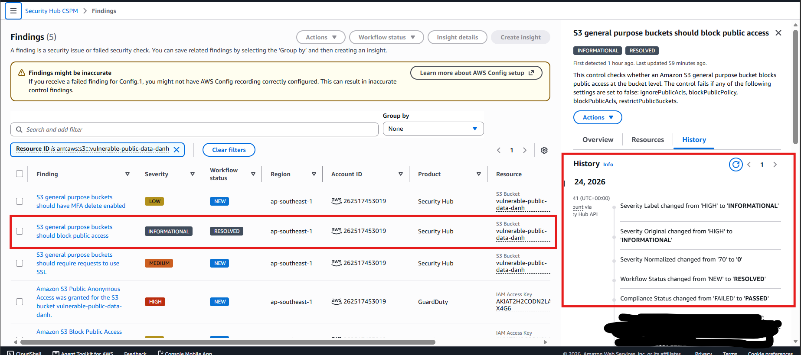
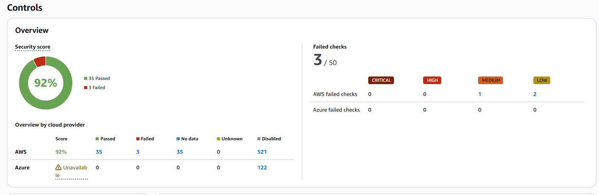

#### Bước 5: Tái thẩm định kết quả

Sau khi hoàn tất các bước gia cố, chúng ta cần xác minh rằng các hành động khắc phục đã hiệu quả.

1. **Chờ chu kỳ quét mới**

   Security Hub chạy quét tuân thủ định kỳ. Chờ khoảng **30-60 phút** để quá trình quét tiếp theo hoàn tất sau khi bạn thay đổi cấu hình.

2. **Kiểm tra lại Security Hub findings**

   Vào **Security Hub** → **CSPM** → **Findings** và kiểm tra trạng thái của các control đã được gắn cờ trước đó:

   | Mã Control | Trước khi gia cố | Sau khi gia cố |
   |------------|-----------------|----------------|
   | S3.2 (Chặn S3 public) | **Failed** | **Passed** X |
   | IAM.1 (Không có policy toàn quyền) | **Failed** | **Passed** X |
   | EC2.19 (Giới hạn SSH) | **Failed** | **Passed** X |

    

   > **Lưu ý:** Các findings riêng lẻ trong **CSPM → Findings** được cập nhật nhanh chóng sau khi khắc phục. Tuy nhiên, điểm số bảo mật tổng thể và trạng thái control tổng hợp trong **Security Hub → Summary** chỉ được tính toán lại mỗi **24 giờ** một lần. Nếu điểm số chưa cập nhật, hãy kiểm tra lại vào ngày hôm sau.

3. **So sánh điểm số tuân thủ**

   - Vào **Security Hub** → **CSPM** → **Controls** để xem security score.
   - So sánh **Security score** hiện tại với ảnh chụp từ Bước 3.
   - Điểm số sẽ tăng lên đáng kể sau khi gia cố.
   - Chụp ảnh màn hình mới cho thấy điểm số đã cải thiện.

4. **Xác nhận GuardDuty alerts**

   Các cảnh báo GuardDuty từ lần giả lập tấn công trước đó vẫn còn; nhưng sẽ không có cảnh báo nghiêm trọng mới nào được tạo ra từ hạ tầng đã được gia cố.

5. ***(Tùy chọn)*** **Khắc phục thêm các control S3**

   Nếu bạn muốn đi xa hơn, dưới đây là hai control bảo mật S3 phổ biến có thể khắc phục để cải thiện điểm tuân thủ.

   **a. S3 general purpose buckets nên yêu cầu SSL cho các yêu cầu**

   Control này kiểm tra xem các bucket S3 có chính sách bucket yêu cầu `aws:SecureTransport` hay không. Áp dụng chính sách sau để chặn các yêu cầu không qua SSL:

   ```bash
   aws s3api put-bucket-policy --bucket <tên-bucket-của-bạn> --policy '{
     "Version": "2012-10-17",
     "Statement": [{
       "Sid": "DenyInsecureConnections",
       "Effect": "Deny",
       "Principal": "*",
       "Action": "s3:*",
       "Resource": "arn:aws:s3:::<tên-bucket-của-bạn>/*",
       "Condition": {
         "Bool": {"aws:SecureTransport": "false"}
       }
     }]
   }'
   ```

   Sau khi áp dụng, kiểm tra control đã chuyển sang **Passed** trong chu kỳ quét tiếp theo và chụp ảnh màn hình trạng thái.

   **b. S3 general purpose buckets nên bật MFA delete**

   MFA Delete thêm một lớp bảo vệ bằng cách yêu cầu xác thực đa yếu tố cho các thao tác xóa vĩnh viễn.

   > **Lưu ý:** MFA Delete chỉ có thể được bật bởi **người dùng root** của tài khoản AWS và yêu cầu thiết bị MFA đã được cấu hình.

   ```bash
   aws s3api put-bucket-versioning \
       --bucket <tên-bucket-của-bạn> \
       --versioning-configuration Status=Enabled,MFADelete=Enabled \
       --mfa "arn:aws:iam::<account-id>:mfa/root-account-mfa-device <mfa-code>"
   ```

   > **Lưu ý:** Đây là thao tác nhạy cảm. Sau khi bật, tất cả thao tác xóa đều yêu cầu xác thực MFA. Hãy thận trọng khi sử dụng trong môi trường production.

   Sau khi hoàn tất các bước khắc phục tùy chọn này, hãy chờ lần quét Security Hub tiếp theo (30-60 phút) để kiểm tra trạng thái **Passed** cho từng control 

<br>
*Điểm số CSPM của Security Hub sau khi đã được gia cố, khắc phục gần như tất cả các findings và đạt trạng thái Passed cho các Controls*

{}
```bash
# 1. Kiểm tra trạng thái S3.2 (sẽ là PASSED sau khi gia cố)
aws securityhub get-findings \
    --filters '{"ComplianceSecurityControlId":[{"Value":"S3.2","Comparison":"EQUALS"}]}' \
    --query 'Findings[].Compliance.Status' \
    --region ap-southeast-1

# 2. Kiểm tra trạng thái IAM.1
aws securityhub get-findings \
    --filters '{"ComplianceSecurityControlId":[{"Value":"IAM.1","Comparison":"EQUALS"}]}' \
    --query 'Findings[].Compliance.Status' \
    --region ap-southeast-1

# 3. Kiểm tra trạng thái EC2.19
aws securityhub get-findings \
    --filters '{"ComplianceSecurityControlId":[{"Value":"EC2.19","Comparison":"EQUALS"}]}' \
    --query 'Findings[].Compliance.Status' \
    --region ap-southeast-1

```
{}
